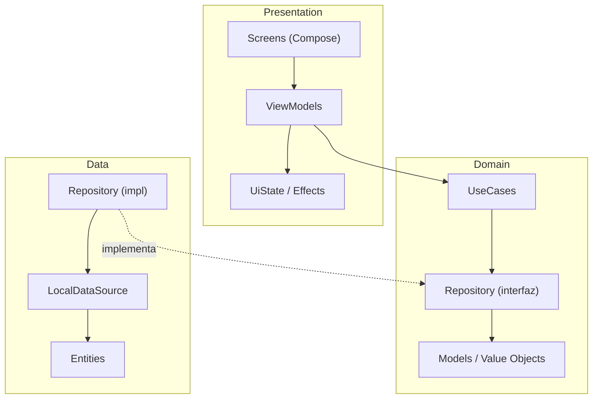

# Sistema de gestión de clientes OrionTek

Este es un sistema de gestión de clientes desarrollado como prueba técnica para OrionTek. Permite crear, consultar, editar y eliminar clientes, donde cada cliente puede tener múltiples direcciones.

## Stack Tecnológico

| Categoría | Tecnología |
|---|---|
| Lenguaje | Kotlin |
| UI | Jetpack Compose + Material 3 |
| Arquitectura | Clean Architecture + MVVM |
| DI | Dagger Hilt |
| Async | Kotlin Coroutines + Flow |
| Testing | JUnit 4, MockK, Coroutines-test |
| Min SDK | 24 (Android 7.0) |

## Arquitectura

El proyecto sigue **Clean Architecture** con separación estricta en tres capas. Cada capa solo conoce a la que está por debajo, nunca al revés.



### ¿Por qué esta estructura?

- **Domain no depende de nada externo.** Los modelos validan sus propias reglas de negocio desde el constructor. Si un `Email` no tiene formato válido, ni siquiera se puede instanciar.
- **Data es intercambiable.** Hoy usa un repositorio en memoria. Mañana puede ser Room o una API REST. Solo cambiaría el binding en `AppModule`, sin tocar un solo ViewModel o UseCase. Lo formulé así para pensar en la escalabilidad y mantenibilidad del código.
- **Presentation no conoce la fuente de datos.** Los ViewModels consumen UseCases y exponen `StateFlow`. Compose observa y recompone.

## Estructura del Proyecto

```
app/src/main/java/.../
├── app/
│   ├── MainActivity.kt                      # Entry point (@AndroidEntryPoint)
│   ├── OrionTekApplication.kt               # @HiltAndroidApp
│   └── navigation/
│       ├── Screen.kt                        # Rutas de navegación
│       └── AppNavGraph.kt                   # NavHost con las 3 pantallas
│
├── core/
│   ├── common/Result.kt                     # Wrapper genérico Success/Error
│   └── di/
│       ├── AppModule.kt                     # Bindings de Hilt
│       └── ClientRepositoryImpl.kt          # Adaptador Data → Domain
│
└── feature/clients/
    ├── data/
    │   ├── local/
    │   │   ├── ClientLocalDataSource.kt     # Interfaz de acceso a datos
    │   │   └── entity/                      # ClientEntity, AddressEntity
    │   └── repository/
    │       └── InMemoryClientRepository.kt  # Implementación en memoria
    │
    ├── domain/
    │   ├── model/                           # Client, Address, Email, PhoneNumber, Identification
    │   ├── repository/ClientRepository.kt   # Contrato del repositorio
    │   └── usecase/                         # 9 UseCases (CRUD + direcciones)
    │
    └── presentation/
        ├── model/ClientUiModel.kt           # Mapeo Domain → UI
        ├── client_list/                     # Screen + ViewModel + UiState
        ├── client_detail/                   # Screen + ViewModel + UiState
        └── client_form/                     # Screen + ViewModel + UiState
```

## Testing

El proyecto tiene **119 tests unitarios** distribuidos en todas las capas.

### Ejecutar tests

```bash
# Todos los tests
./gradlew test

# Solo tests de una capa específica
./gradlew test --tests "*.domain.usecase.*"
./gradlew test --tests "*.presentation.*"
./gradlew test --tests "*.data.*"
```

## Cómo correr el proyecto

### Requisitos
- Android Studio Ladybug o superior
- JDK 11+
- Android SDK 36

### Pasos

```bash
# Clonar
git clone https://github.com/yvniel09/oriontek-clients-manager.git

# Abrir en Android Studio y ejecutar en emulador/dispositivo
# O desde terminal:
./gradlew assembleDebug
# APK generado en: app/build/outputs/apk/debug/app-debug.apk
```

## Proceso de desarrollo

### Lo que definí yo

La parte que más me involucró como profesional fue la toma de decisiones arquitectónicas. 
Todo mi proceso de desarrollo lo documenté en las Pull Request del repositorio, pueden ver todo para mis desiciones técnicas en cada una de ellas.

### ¿Utilicé inteligencia artificial?

Claro! Hoy en día es indispensable desarrollar con un modelo de lenguaje pero de forma estratégica. En mi caso lo utilicé para:

1. **Generación de código repetitivo**: Scaffolding de ViewModels, UiStates y Screens que siguen el mismo patrón MVVM. Una vez definí la estructura del primero, la IA me ayudó a replicar el patrón consistentemente en los demás.
2. **Boilerplate de Hilt y navegación**: La configuración de `AppModule`, `NavGraph` y el wiring entre capas sigue patrones muy documentados. La IA aceleró eso.
3. **Debugging**: Cuando los tests fallaron por incompatibilidad de MockK con `@JvmInline value class`, la IA diagnosticó el problema y propuso la solución correcta luego la implementé y solucioné el problema sin tener que buscar, solo entendí y apliqué donde resolver la situación.

### Lo que me costó y lo que fue natural

Lo más natural fue trabajar con el dominio. Definir los modelos, entender las reglas de negocio (tipos de identificación dominicanos, validaciones de formato, relación cliente-direcciones) y traducirlos a código fue donde más cómodo me sentí. Es la parte donde el desarrollador tiene que pensar, no solo escribir.

Lo que requirió más atención fue el manejo de estado en la capa de presentación, particularmente la distinción entre estado persistente y efectos de un solo disparo. Compose recompone la UI en cada cambio de estado, así que si pones una navegación dentro del estado, se ejecuta infinitamente. Entender ese matiz y resolverlo correctamente fue lo más técnicamente exigente.

La inyección de dependencias con Hilt fue directa pero requirió cuidado en el orden de los bindings: primero el `LocalDataSource`, luego el `ClientRepositoryImpl` que adapta datos a dominio, y finalmente los UseCases que Hilt inyecta automáticamente en los ViewModels.
